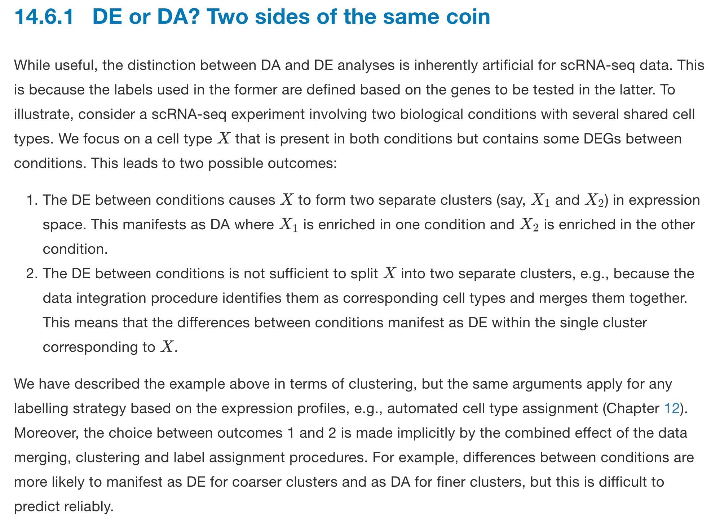

# scRNAseq-analysis-notes
my scRNAseq analysis notes.
Please also check https://github.com/mdozmorov/scRNA-seq_notes from [Mikhail Dozmorov](https://github.com/mdozmorov) and https://github.com/seandavi/awesome-single-cell

I have another repo for [awesome spatial omics](https://github.com/crazyhottommy/awesome_spatial_omics)
## The reason
Single cell RNAseq is becoming more and more popular, and as a technique, it might become as common as PCR. I just got some 10x genomics single cell RNAseq data to play with, it is a good time for me to take down notes here. I hope it is useful for other people as well.


## readings before doing anything

### single cell tutorials

* reivew papers in this thread https://twitter.com/rmassonix/status/1577714756047278080
* [Single-cell biology: what does the future hold?](https://www.embopress.org/doi/full/10.15252/msb.202311799)
* [scverse](https://scverse.org/) Foundational tools for single-cell omics data in the life sciences.
* [Course material in notebook format for learning about single cell bioinformatics methods](https://github.com/YeoLab/single-cell-bioinformatics)
* [Analysis of single cell RNA-seq data course, Cambridge University](https://github.com/hemberg-lab/scRNA.seq.course) Great tutorial!
* [Current best practices in single‐cell RNA‐seq analysis: a tutorial](https://www.embopress.org/doi/10.15252/msb.20188746) github repo https://github.com/theislab/single-cell-tutorial
* [f1000 workflow paper A step-by-step workflow for low-level analysis of single-cell RNA-seq data](http://f1000research.com/articles/5-2122/v1) by Aaron Lun, the athour of diffHiC, GenomicInteractions and csaw.
* [SimplesingleCell](https://bioconductor.org/packages/release/workflows/html/simpleSingleCell.html) A step-by-step workflow for low-level analysis of single-cell RNA-seq data with Bioconductor by Aaron Lun as well!
* [2016 Bioconductor workshop: Analysis of single-cell RNA-seq data with R and Bioconductor](https://github.com/drisso/bioc2016singlecell)
* [Orchestrating Single-Cell Analysis with Bioconductor](https://bioconductor.github.io/OrchestratingSingleCellAnalysis/)
* [single cell best practices](https://www.sc-best-practices.org/preamble.html) by the Scanpy group
* [paper: Single-Cell Transcriptomics Bioinformatics and Computational Challenges](http://journal.frontiersin.org/article/10.3389/fgene.2016.00163/full)
* [Single Cell RNA-seq (scRNA-seq) Library Structure](https://teichlab.github.io/scg_lib_structs/)
* [Variance stabilizing scRNA-seq counts](http://www.nxn.se/valent/2017/10/15/variance-stabilizing-scrna-seq-counts) is log2(x+1) reasonable?
* [Aaron Lun’s single-cell thoughts](https://ltla.github.io/SingleCellThoughts/) on Linearity, Transformation, Standardization, Clustering, Cellular detection rate and Bootstrapping.
* [How to tune hyperparameters of tSNE](https://towardsdatascience.com/how-to-tune-hyperparameters-of-tsne-7c0596a18868)
* [How to cluster in High Dimensions](https://towardsdatascience.com/how-to-cluster-in-high-dimensions-4ef693bacc6)
* [Deep Learning for Single Cell Biology](https://towardsdatascience.com/deep-learning-for-single-cell-biology-935d45064438)
* [12 Grand challenges in single-cell data science](https://peerj.com/preprints/27885/)
* [Single-Cell RNA Sequencing in Cancer: Lessons Learned and Emerging Challenges](https://www.sciencedirect.com/science/article/abs/pii/S1097276519303569)
* [A Single-Cell Sequencing Guide for Immunologists](https://www.frontiersin.org/articles/10.3389/fimmu.2018.02425/full)
* [Multi-omics integration in the age of million single-cell data](https://www.nature.com/articles/s41581-021-00463-x) Nature reviews

### database

* [CuratedAtlasQueryR](https://stemangiola.github.io/CuratedAtlasQueryR/) is a query interface that allow the programmatic exploration and retrieval of the harmonised, curated and reannotated CELLxGENE single-cell human cell atlas. Data can be retrieved at cell, sample, or dataset levels based on filtering criteria.

* cellxgene census. Now, from R, computational biologists can access the Census data which is the largest standardized aggregation of single-cell data, composed of >33M cells and >60K genes. https://chanzuckerberg.github.io/cellxgene-census/articles/2023/20230808-r_api_release.html

### scRNAseq experimental design
* [paper: Design and Analysis of Single-Cell Sequencing Experiments](https://www.cell.com/cell/fulltext/S0092-8674(15)01353-7)
* [paper: Experimental design for single-cell RNA sequencing](https://academic.oup.com/bfg/article/17/4/233/4604806)
* [paper: How to design a single-cell RNA-sequencing experiment: pitfalls, challenges and perspectives](https://academic.oup.com/bib/advance-article/doi/10.1093/bib/bby007/4831233)
* [GT-TS: Experimental design for maximizing cell type discovery in single-cell data](https://www.biorxiv.org/content/early/2018/08/07/386540)
* [Tutorial: guidelines for the experimental design of single-cell RNA sequencing studies](https://www.nature.com/articles/s41596-018-0073-y)

### New technology

* [Microfluidics-free single-cell genomics with templated emulsification](https://www.nature.com/articles/s41587-023-01685-z)
* [seqspec is a machine-readable YAML file format for genomic library sequence and structure](https://github.com/IGVF/seqspec)
  
### remove ambient RNA

* [SoupX](https://github.com/constantAmateur/SoupX)
* [Cellbender](https://github.com/broadinstitute/CellBender)

### single cell RNA-seq normalization

* [Normalizing need not be the norm: count-based math for analyzing single-cell data](https://www.biorxiv.org/content/10.1101/2022.06.01.494334v1)
* [paper: Performance Assessment and Selection of Normalization Procedures for Single-Cell RNA-Seq](https://www.biorxiv.org/content/10.1101/235382v2)
* [paper: Assessment of single cell RNA-seq normalization methods](http://biorxiv.org/content/early/2016/07/17/064329)
* [paper: A practical guide to single-cell RNA-sequencing for biomedical research and clinical applications](https://genomemedicine.biomedcentral.com/articles/10.1186/s13073-017-0467-4)
* [Normalizing single-cell RNA sequencing data: challenges and opportunities](https://www.nature.com/nmeth/journal/v14/n6/full/nmeth.4292.html) Nature Methods
* [SinQC: A Method and Tool to Control Single-cell RNA-seq Data Quality](http://www.morgridge.net/SinQC.html).
* [Scone](https://github.com/YosefLab/scone) Single-Cell Overview of Normalized Expression data

### single cell impute 
* [SAVER: gene expression recovery for single-cell RNA sequencing](https://www.nature.com/articles/s41592-018-0033-z)  an expression recovery method for unique molecule index (UMI)-based scRNA-seq data that borrows information across genes and cells to provide accurate expression estimates for all genes.

* [DeepImpute: an accurate, fast and scalable deep neural network method to impute single-cell RNA-Seq data](https://github.com/lanagarmire/DeepImpute) https://www.biorxiv.org/content/early/2018/06/22/353607
* [MAGIC](https://github.com/krishnaswamylab/MAGIC) (Markov Affinity-based Graph Imputation of Cells), is a method for imputing missing values restoring structure of large biological datasets.
* [bayNorm: Bayesian gene expression recovery, imputation and normalisation for single cell RNA-sequencing data](https://www.biorxiv.org/content/early/2018/08/03/384586?) github [page](https://github.com/WT215/bayNorm)
* [Zero-preserving imputation of scRNA-seq data using low-rank approximation](https://www.biorxiv.org/content/early/2018/08/22/397588?rss=1)

### single cell batch effect

* [One Cell At a Time (OCAT): a unified framework to integrate and analyze single-cell RNA-seq data](https://genomebiology.biomedcentral.com/articles/10.1186/s13059-022-02659-1)

* [Benchmarking atlas-level data integration in single-cell genomics](https://www.biorxiv.org/content/10.1101/2020.05.22.111161v1)

* [Overcoming confounding plate effects in differential expression analyses of single-cell RNA-seq data](http://biorxiv.org/content/early/2016/09/08/073973)

* [Batch effects in single-cell RNA-sequencing data are corrected by matching mutual nearest neighbors](https://www.nature.com/articles/nbt.4091)

* [Panoramic stitching of heterogeneous single-cell transcriptomic data](https://www.biorxiv.org/content/early/2018/07/17/371179) Here we present [Scanorama](http://cb.csail.mit.edu/cb/scanorama/), inspired by algorithms for panorama stitching, that overcomes the limitations of existing methods to enable accurate, heterogeneous scRNA-seq data set integration.

* [Fast Batch Alignment of Single Cell Transcriptomes Unifies Multiple Mouse Cell Atlases into an Integrated Landscape](https://www.biorxiv.org/content/early/2018/08/22/397042) [github link](https://github.com/Teichlab/bbknn)

* [Scalable integration of single cell RNAseq data for batch correction and meta analysis](https://github.com/immunogenomics/harmony)

* [liger](https://macoskolab.github.io/liger/)R package for integrating and analyzing multiple single-cell datasets
* [scMerge](https://www.biorxiv.org/content/early/2018/08/16/393280)
* [Seurat V3](https://satijalab.org/seurat/v3.0/integration.html)
* [Cons](https://github.com/hms-dbmi/conos) Joint analysis of heterogeneous single-cell RNA-seq dataset collections. Single-cell RNA sequencing is often applied in study designs that include multiple individuals, conditions or tissues. To identify recurrent cell subpopulations in such heterogeneous collections, we developed Conos, an approach that relies on multiple plausible inter-sample mappings to construct a global graph connecting all measured cells. The graph enables identification of recurrent cell clusters and propagation of information between datasets in multi-sample or atlas-scale collections. published in [Nature Methods](https://www.nature.com/articles/s41592-019-0466-z?error=cookies_not_supported&code=5680289b-6edb-40ad-9934-415dac4fdb2f)
* [scAlign](https://bioconductor.org/packages/release/bioc/html/scAlign.html) Bioconductor package. a tool for alignment, integration, and rare cell identification from scRNA-seq data
* For integration, Harmony seems to be the best. https://genomebiology.biomedcentral.com/articles/10.1186/s13059-019-1850-9
* [Nonnegative matrix factorization integrates single-cell multi-omic datasets with partially overlapping features](https://www.biorxiv.org/content/10.1101/2021.04.09.439160v1.full) LIGER R package 

### Benchmark single cell pipeline

* [MatchScore2](https://github.com/elimereu/matchSCore2) paper: [Benchmarking Single-Cell RNA Sequencing Protocols for Cell Atlas Projects](https://www.biorxiv.org/content/10.1101/630087v1)

* [Benchmarking single cell RNA-sequencing analysis pipelines using mixture control experiments](https://www.nature.com/articles/s41592-019-0425-8) [code and data](https://github.com/LuyiTian/CellBench_data) [cellbench](https://bioconductor.org/packages/release/bioc/html/CellBench.html) bioconductor package.

* [pipeComp, a general framework for the evaluation of computational pipelines, reveals performant single-cell RNA-seq preprocessing tools](https://www.biorxiv.org/content/10.1101/2020.02.02.930578v1) https://github.com/plger/pipeComp by Mark Robinson group.

### Differential expression 

* [A discriminative learning approach to differential expression analysis for single-cell RNA-seq](https://www.nature.com/articles/s41592-018-0303-9) by Lior Patcher group.
* [scde](http://bioconductor.org/packages/release/bioc/html/scde.html) bioconductor package maintained by Jean Fan in Xiaowei Zhuang's lab at Harvard. Need to talk to her once I get a chance.
* [Presto](https://github.com/immunogenomics/presto)Fast Wilcoxon and auROC for single cell RNAseq and scATACseq data. take a look!
* How to compare clusters with multiple samples? https://twitter.com/RoryKirchner/status/1082752967806210048 . work in progess https://github.com/HelenaLC/muscat by Helena from Mark Robinson lab. bioc2019 workshop http://biocworkshops2019.bioconductor.org.s3-website-us-east-1.amazonaws.com/page/muscWorkshop__vignette/
and a blog post by VALENTINE SVENSSON from Lior Patcher's group http://www.nxn.se/valent/2019/2/15/handling-confounded-samples-for-differential-expression-in-scrna-seq-experiments

#### for multi-sample multi-group differential analysis

* [SEACells infers transcriptional and epigenomic cellular states from single-cell genomics data](https://www.nature.com/articles/s41587-023-01716-9)
* [Analysis of multi-condition single-cell data with latent embedding multivariate regression](https://www.biorxiv.org/content/10.1101/2023.03.06.531268v1)
* [An Empirical Bayes Method for Differential Expression Analysis of Single Cells with Deep Generative Models](https://www.biorxiv.org/content/10.1101/2022.05.27.493625v1) scVI-DE
* [muscat](http://www.bioconductor.org/packages/release/bioc/html/muscat.html)
* [Confronting false discoveries in single-cell differential expression](https://www.nature.com/articles/s41467-021-25960-2) "These observations suggest that, in practice, pseudobulk approaches provide an excellent trade-off between speed and accuracy for single-cell DE analysis." One needs to considder biolgoical replicates, pseduobulk works well.
* [Modelling group heteroscedasticity in single-cellRNA-seq pseudo-bulk data](https://www.biorxiv.org/content/10.1101/2022.09.12.507511v1)
* [BSDE: barycenter single-cell differential expression for case–control studies](https://academic.oup.com/bioinformatics/article/38/10/2765/6554192?login=false)


* [distinct](http://www.bioconductor.org/packages/release/bioc/html/distinct.html) Both are from Mark Robinson group.
* [nebula](https://github.com/lhe17/nebula) https://www.biorxiv.org/content/biorxiv/early/2020/09/25/2020.09.24.311662.full.pdf
* [Fast identification of differential distributions in single-cell RNA-sequencing data with waddR](https://academic.oup.com/bioinformatics/advance-article/doi/10.1093/bioinformatics/btab226/6207964) https://github.com/goncalves-lab/waddR
* [CoCoA-diff: counterfactual inference for single-cell gene expression analysis](https://genomebiology.biomedcentral.com/articles/10.1186/s13059-021-02438-4)
* [Bias, robustness and scalability in single-cell differential expression analysis](https://www.nature.com/articles/nmeth.4612) From Mark Robinson group.
* [Comparative analysis of differential gene expression analysis tools for single-cell RNA sequencing data](https://bmcbioinformatics.biomedcentral.com/articles/10.1186/s12859-019-2599-6) "We observed that current methods designed for scRNAseq data do not tend to show better performance compared to methods designed for bulk RNAseq data."
* [Tree-based Correlation Screen and Visualization for Exploring Phenotype-Cell Type Association in Multiple Sample Single-Cell RNA-Sequencing Experiments](https://www.biorxiv.org/content/10.1101/2021.10.27.466024v1) TreeCorTreat is an open source R package that tackles this problem by using a tree-based correlation screen to analyze and visualize the association between phenotype and transcriptomic features and cell types at multiple cell type resolution levels.
* [Quantifying the effect of experimental perturbations in single-cell RNA-sequencing data using graph signal processing](https://www.biorxiv.org/content/10.1101/532846v3) read this thread https://twitter.com/krishnaswamylab/status/1328876444810960896?s=27
* [Causal identification of single-cell experimental perturbation effects with CINEMA-OT](https://www.biorxiv.org/content/10.1101/2022.07.31.502173v1)
github https://github.com/vandijklab/CINEMA-OT
* [IDEAS: individual level differential expression analysis for single-cell RNA-seq data](https://genomebiology.biomedcentral.com/articles/10.1186/s13059-022-02605-1)

### Single cell RNA-seq

* [a collection of single RNA-seq tools by Sean Davis ](https://github.com/seandavi/awesome-single-cell)
* [MAESTRO](https://github.com/liulab-dfci/MAESTRO)(Model-based AnalysEs of Single-cell Transcriptome and RegulOme) is a comprehensive single-cell RNA-seq and ATAC-seq analysis suit built using snakemake
* [paper: Design and computational analysis of single-cell RNA-sequencing experiments](http://genomebiology.biomedcentral.com/articles/10.1186/s13059-016-0927-y)
* [paper by Mark Robinson: Bias, Robustness And Scalability In Differential Expression Analysis Of Single-Cell RNA-Seq Data](http://biorxiv.org/content/early/2017/05/28/143289)

> Considerable differences are found between the methods in terms of the number and characteristics of the genes that are called differentially expressed. Pre-filtering of lowly expressed genes can have important effects on the results, particularly for some of the methods originally developed for analysis of bulk RNA-seq data. Generally, however, **methods developed for bulk RNA-seq analysis do not perform notably worse than those developed specifically for scRNA-seq.**

* [paper: Power Analysis of Single Cell RNA‐Sequencing Experiments](http://biorxiv.org/content/early/2016/09/08/073692)
* [Quantifying the tradeoff between sequencing depth and cell number in single-cell RNA-seq](https://www.biorxiv.org/content/10.1101/762773v1.full.pdf)

> Above about 15,000 reads per cell the benefit of increased sequencing depth is minor. 

* [paper: The contribution of cell cycle to heterogeneity in single-cell RNA-seq data](http://www.nature.com/nbt/journal/v34/n6/full/nbt.3498.html)
* [paper: Batch effects and the effective design of single-cell gene expression studies](http://biorxiv.org/content/early/2016/07/08/062919)
* [On the widespread and critical impact of systematic bias and batch effects in single-cell RNA-Seq data](http://biorxiv.org/content/early/2015/08/25/025528) 
* [paper: Comparison of methods to detect differentially expressed genes between single-cell populations](http://www.ncbi.nlm.nih.gov/pubmed/27373736)
* [review: Single-cell genome sequencing: current state of the science](http://www.nature.com/nrg/journal/vaop/ncurrent/full/nrg.2015.16.html)  
* [Ginkgo](http://qb.cshl.edu/ginkgo/?q=/ESjKTTeZIdnoGwEB4WTu) A web tool for analyzing single-cell sequencing data.
* [SingleCellExperiment bioc package](http://bioconductor.org/packages/devel/bioc/html/SingleCellExperiment.html) Defines a S4 class for storing data from single-cell experiments. This includes specialized methods to store and retrieve spike-in information, dimensionality reduction coordinates and size factors for each cell, along with the usual metadata for genes and libraries.
* [ASAP](http://biorxiv.org/content/early/2016/12/22/096222): a Web-based platform for the analysis and inter-active visualization of single-cell RNA-seq data
* [Seurat](http://www.satijalab.org/seurat.html) is an R package designed for the analysis and visualization of single cell RNA-seq data. It contains easy-to-use implementations of commonly used analytical techniques, including the identification of highly variable genes, dimensionality reduction (PCA, ICA, t-SNE), standard unsupervised clustering algorithms (density clustering, hierarchical clustering, k-means), and the discovery of differentially expressed genes and markers.
* [R package for the statistical assessment of cell state hierarchies from single-cell RNA-seq data](http://bioconductor.org/packages/devel/bioc/html/sincell.html)  
* [Monocle](http://cole-trapnell-lab.github.io/monocle-release/) Differential expression and time-series analysis for single-cell RNA-Seq and qPCR experiments.
* Single Cell Differential Expression: bioconductor package [scde](http://bioconductor.org/packages/devel/bioc/html/scde.html)
* [Sincera](https://research.cchmc.org/pbge/sincera.html):A Computational Pipeline for Single Cell RNA-Seq Profiling Analysis. Bioconductor package will be available soon. 
* [MAST](https://github.com/RGLab/MAST): a flexible statistical framework for assessing transcriptional changes and characterizing heterogeneity in single-cell RNA sequencing data
* [scDD](http://biorxiv.org/content/early/2015/11/13/031021): A statistical approach for identifying differential distributions in single-cell RNA-seq experiments
* [Inference and visualisation of Single-Cell RNA-seq Data data as a hierarchical tree structure: bioconductor CellTree](http://bioconductor.org/packages/devel/bioc/html/cellTree.html)  
* [Fast and accurate single-cell RNA-Seq analysis by clustering of transcript-compatibility counts](http://biorxiv.org/content/early/2016/01/15/036863) by Lior Pachter et.al
* [cellity](https://github.com/ti243/cellity): Classification of low quality cells in scRNA-seq data using R.
* [bioconductor: using scran to perform basic analyses of single-cell RNA-seq data](http://bioconductor.org/packages/devel/bioc/vignettes/scran/inst/doc/scran.html)
* [scater](https://github.com/davismcc/scater): single-cell analysis toolkit for expression with R
* [Monovar](http://www.nature.com/nmeth/journal/vaop/ncurrent/full/nmeth.3835.html): single-nucleotide variant detection in single cells
* [paper: Comparison of methods to detect differentially expressed genes between single-cell populations](http://m.bib.oxfordjournals.org/content/early/2016/07/02/bib.bbw057.full)
* [Single-cell mRNA quantification and differential analysis with Census](http://www.nature.com/nmeth/journal/vaop/ncurrent/full/nmeth.4150.html)
* [CIDR](https://github.com/VCCRI/CIDR): Ultrafast and accurate clustering through imputation for single-cell RNA-seq data
* [CellView](http://biorxiv.org/content/early/2017/04/04/123810): Interactive Exploration Of High Dimensional Single Cell RNA-Seq Data
* [Scanpy](https://github.com/theislab/scanpy) is a scalable toolkit for analyzing single-cell gene expression data. It includes preprocessing, visualization, clustering, pseudotime and trajectory inference, differential expression testing and simulation of gene regulatory networks. The Python-based implementation efficiently deals with datasets of more than one million cells.

### perturbation 

* Single cell perturbation prediction https://scgen.readthedocs.io A tensorflow implementation of scGen. scGen is a generative model to predict single-cell perturbation response across cell types, studies and species.

### cell type annotation

* [Tutorial: guidelines for annotating single-cell transcriptomic maps using automated and manual methods](https://www.nature.com/articles/s41596-021-00534-0)
* [celltypist](https://www.celltypist.org/encyclopedia)
* [scAnnotatR](https://bmcbioinformatics.biomedcentral.com/articles/10.1186/s12859-022-04574-5): framework to accurately classify cell types in single-cell RNA-sequencing data
* [Efficient and precise single-cell reference atlas mapping with Symphony](https://www.biorxiv.org/content/10.1101/2020.11.18.389189v1) by Soumya group at Harvard (the same group developed Harmony), a novel algorithm for building compressed, integrated reference atlases of ≥106 cells and enabling efficient query mapping within seconds.
* [scMatch: a single-cell gene expression profile annotation tool using reference datasets](https://academic.oup.com/bioinformatics/advance-article/doi/10.1093/bioinformatics/btz292/5480299)
* [Celaref](https://github.com/MonashBioinformaticsPlatform/celaref)
* [MetaNeighbour](https://github.com/maggiecrow/MetaNeighbor)
* [scID](https://github.com/BatadaLab/scID)
* [scMCA](https://github.com/ggjlab/scMCA)
* [scPred](https://github.com/IMB-Computational-Genomics-Lab/scPred)
* [SingleR](https://github.com/dviraran/SingleR)
* [singleCellNet](https://www.biorxiv.org/content/10.1101/508085v1)
* [CellAsign](https://github.com/Irrationone/cellassign) paper: [Probabilistic cell-type assignment of single-cell RNA-seq for tumor microenvironment profiling](https://www.nature.com/articles/s41592-019-0529-1) in Nature Methods.
* [Garnnet](https://cole-trapnell-lab.github.io/garnett/) Paper: [Supervised classification enables rapid annotation of cell atlases](https://www.nature.com/articles/s41592-019-0535-3) in Nature Methods
* [Interpretation of T cell states from single-cell transcriptomics data using reference atlases](https://www.nature.com/articles/s41467-021-23324-4) projecTILs https://github.com/carmonalab/ProjecTILs also see https://twitter.com/carmonation/status/1440371664957542418 https://www.biorxiv.org/content/10.1101/2021.09.20.458613v1 CD4+ altlas, project your own data https://spica.unil.ch/
* [projectR](https://pubmed.ncbi.nlm.nih.gov/31121116/) https://github.com/genesofeve/projectR


### single cell RNA-seq clustering

* [Evaluation of Cell Type Deconvolution R Packages on Single Cell RNA-seq Data](https://www.biorxiv.org/content/10.1101/827139v1)
compared Seurat, scmap, SingleR, CHETAH, SingleCellNet, scID, Garnett, SCINA.

>Overall, methods such as Seurat, SingleR, CP, RPC and SingleCellNet performed well, with Seurat being the best at annotating major cell types. Also, Seurat, SingleR and CP are more robust against down-sampling. However, Seurat does have a major drawback at predicting rare cell populations, and it is suboptimal at differentiating cell types that are highly similar to each other, while SingleR and CP are much better in these aspects

* [Evaluation of single-cell classifiers for single-cell RNA sequencing data sets](https://academic.oup.com/bib/advance-article/doi/10.1093/bib/bbz096/5593804)
* [Single Cell Clustering Comparison](https://jef.works/blog/2018/06/28/single-cell-clustering-comparison/) A blog post.
* [A systematic performance evaluation of clustering methods for single-cell RNA-seq data](https://f1000research.com/articles/7-1141/v1) F1000 paper by Mark Robinson. tl;dr version: "SC3 and Seurat show the most favorable results".
* [Geometry of the Gene Expression Space of Individual Cells](http://journals.plos.org/ploscompbiol/article?id=10.1371/journal.pcbi.1004224)
* [pcaReduce](http://biorxiv.org/content/early/2015/09/08/026385): Hierarchical Clustering of Single Cell Transcriptional Profiles.
* [CountClust](https://www.bioconductor.org/packages/3.3/bioc/html/CountClust.html): Clustering and Visualizing RNA-Seq Expression Data using Grade of Membership Models. Fits grade of membership models (GoM, also known as admixture models) to cluster RNA-seq gene expression count data, identifies characteristic genes driving cluster memberships, and provides a visual summary of the cluster memberships
* [FastProject](http://biorxiv.org/content/early/2016/03/12/043463): A Tool for Low-Dimensional Analysis of Single-Cell RNA-Seq Data
* [SNN-Cliq](http://bioinformatics.oxfordjournals.org/content/31/12/1974.full) Identification of cell types from single-cell transcriptomes using a novel clustering method
* [Compare clusterings for single-cell sequencing](http://bioconductor.org/packages/devel/bioc/html/clusterExperiment.html) bioconductor package.The goal of this package is to encourage the user to try many different clustering algorithms in one package structure. We give tools for running many different clusterings and choices of parameters. We also provide visualization to compare many different clusterings and algorithm tools to find common shared clustering patterns.
* [CIDR: Ultrafast and accurate clustering through imputation for single cell RNA-Seq data](http://biorxiv.org/content/early/2016/08/10/068775)
* [SC3](http://bioconductor.org/packages/release/bioc/html/SC3.html)- consensus clustering of single-cell RNA-Seq data.  SC3 achieves high accuracy and robustness by consistently integrating different clustering solutions through a consensus approach. Tests on twelve published datasets show that SC3 outperforms five existing methods while remaining scalable, as shown by the analysis of a large dataset containing 44,808 cells. Moreover, an interactive graphical implementation makes SC3 accessible to a wide audience of users, and SC3 aids biological interpretation by identifying marker genes, differentially expressed genes and outlier cells.
* [GiniClust2](https://genomebiology.biomedcentral.com/articles/10.1186/s13059-018-1431-3): a cluster-aware, weighted ensemble clustering method for cell-type detection
* [FateID infers cell fate bias in multipotent progenitors from single-cell RNA-seq data](https://www.nature.com/articles/nmeth.4662)
* [matchSCore: Matching Single-Cell Phenotypes Across Tools and Experiments](https://www.biorxiv.org/content/early/2018/05/07/314831) In this work we introduce matchSCore (https://github.com/elimereu/matchSCore), an approach to match cell populations fast across tools, experiments and technologies. We compared 14 computational methods and evaluated their accuracy in clustering and gene marker identification in simulated data sets.
* [Cluster Headache: Comparing Clustering Tools for 10X Single Cell Sequencing Data](https://www.biorxiv.org/content/early/2017/10/19/203752)
* The [celaref](https://github.com/MonashBioinformaticsPlatform/celaref) (cell labelling by reference) package aims to streamline the cell-type identification step, by suggesting cluster labels on the basis of similarity to an already-characterised reference dataset - wheather that's from a similar experiment performed previously in the same lab, or from a public dataset from a similar sample.
* [souporcell: Robust clustering of single cell RNAseq by genotype and ambient RNA inference without reference genotypes](https://www.biorxiv.org/content/10.1101/699637v1) souporcell, a robust method to cluster cells by their genetic variants without a genotype reference and show that it outperforms existing methods on clustering accuracy, doublet detection, and genotyping across a wide range of challenging scenarios while accurately estimating the amount of ambient RNA in the sample

### dimension reduction and visualization of clusters

#### fast PCA for big matrix
* https://github.com/cresswellkg/FastPCA by Mikhail Dozmorov lab. backend is the PRIMME.
* [BiocSingular](https://www.bioconductor.org/packages/release/bioc/html/BiocSingular.html)
* [RSpectra](https://cran.r-project.org/web/packages/RSpectra/index.html) works for sparse matrix as well.

* [Principal Component Analysis Explained Visually](http://setosa.io/ev/principal-component-analysis/)  
* [PCA, MDS, k-means, Hierarchical clustering and heatmap](https://rpubs.com/crazyhottommy/PCA_MDS). I wrote it.
* [horseshoe effect from PCA](http://www.huber.embl.de/users/whuber/pub/horseshoe.html) Spurious structures in latent space decomposition and low-dimensional embedding methods
* also read chapter 9 of http://web.stanford.edu/class/bios221/book/Chap-MultivaHetero.html
* [A tale of two heatmaps](https://rpubs.com/crazyhottommy/a-tale-of-two-heatmap-functions). I wrote it.
* [Heatmap demystified](https://rpubs.com/crazyhottommy/heatmap_demystified). I wrote it.
* [Cluster Analysis in R - Unsupervised machine learning](http://www.sthda.com/english/wiki/cluster-analysis-in-r-unsupervised-machine-learning#at_pco=smlre-1.0&at_si=58765a95fcb21379&at_ab=per-2&at_pos=3&at_tot=4) very practical intro on STHDA website.
* [I wrote on PCA, and heatmaps on Rpub](https://rpubs.com/crazyhottommy)
* A most read for clustering analysis for high-dimentional biological data:[Avoiding common pitfalls when clustering
biological data](http://stke.sciencemag.org/content/9/432/re6)
* [How does gene expression clustering work?](http://www.nature.com/nbt/journal/v23/n12/full/nbt1205-1499.html) A must read for 
clustering.
* [How to read PCA plots for scRNAseq](http://www.nxn.se/valent/2017/6/12/how-to-read-pca-plots) by VALENTINE SVENSSON.

<blockquote class="twitter-tweet" data-lang="en"><p lang="en" dir="ltr">See <a href="https://t.co/yxCb85ctL1">https://t.co/yxCb85ctL1</a>: &quot;MDS best choice for preserving outliers,  PCA for variance, &amp; T-SNE for clusters&quot; <a href="https://twitter.com/mikelove">@mikelove</a> <a href="https://twitter.com/AndrewLBeam">@AndrewLBeam</a></p>&mdash; Rileen Sinha (@RileenSinha) <a href="https://twitter.com/RileenSinha/status/768873620521250816">August 25, 2016</a></blockquote>
<script async src="//platform.twitter.com/widgets.js" charset="utf-8"></script>

[paper: Outlier Preservation by Dimensionality Reduction Techniques](http://oai.cwi.nl/oai/asset/22628/22628B.pdf)
>"MDS best choice for preserving outliers, PCA for variance, & T-SNE for clusters"

* [How to Use t-SNE Effectively](http://distill.pub/2016/misread-tsne/)
* [t-SNE explained in plain javascript](https://beta.observablehq.com/@nstrayer/t-sne-explained-in-plain-javascript)
* [Rtsne](https://github.com/jkrijthe/Rtsne) R package for T-SNE
* [rtsne](https://github.com/jdonaldson/rtsne) An R package for t-SNE (t-Distributed Stochastic Neighbor Embedding)
a bug was in `rtsne`: https://gist.github.com/mikelove/74bbf5c41010ae1dc94281cface90d32
* [t-SNE-Heatmaps](https://github.com/KlugerLab/t-SNE-Heatmaps) Beta version of 1D t-SNE heatmaps to visualize expression patterns of hundreds of genes simultaneously in scRNA-seq.
* [A tutorial on t-SNE](http://blog.thegrandlocus.com/2018/08/a-tutorial-on-t-sne-1)
* [How to tune hyperparameters of tSNE](https://towardsdatascience.com/how-to-tune-hyperparameters-of-tsne-7c0596a18868) For single-cell RNAseq: The optimal perplexity can be calculated from the number of cells according to the simple power law **Perplexity ~ N^(1/2)**. Finally, the optimal number of iterations should provide the largest distance between the data points of ~100 units.

* when to use PCA instead of t-SNE
https://stats.stackexchange.com/questions/238538/are-there-cases-where-pca-is-more-suitable-than-t-sne/249520#249520

>t-SNE is a great piece of Machine Learning but one can find many reasons to use PCA instead of it. Of the top of my head, I will mention five. As most other computational methodologies in use, t-SNE is no silver bullet and there are quite a few reasons that make it a suboptimal choice in some cases. Let me mention some points in brief:

>Stochasticity of final solution. PCA is deterministic; t-SNE is not. One gets a nice visualisation and then her colleague gets another visualisation and then they get artistic which looks better and if a difference of 0.03% in the KL(P||Q) divergence is meaningful... In PCA the correct answer to the question posed is guaranteed. t-SNE might have multiple minima that might lead to different solutions. This necessitates multiple runs as well as raises questions about the reproducibility of the results.

>Interpretability of mapping. This relates to the above point but let's assume that a team has agreed in a particular random seed/run. Now the question becomes what this shows... t-SNE tries to map only local / neighbours correctly so our insights from that embedding should be very cautious; global trends are not accurately represented (and that can be potentially a great thing for visualisation). On the other hand, PCA is just a diagonal rotation of our initial covariance matrix and the eigenvectors represent a new axial system in the space spanned by our original data. We can directly explain what a particular PCA does.

>Application to new/unseen data. t-SNE is not learning a function from the original space to the new (lower) dimensional one and that's a problem. On that matter, t-SNE is a non-parametric learning algorithm so approximating with parametric algorithm is an ill-posed problem. The embedding is learned by directly moving the data across the low dimensional space. That means one does not get an eigenvector or a similar construct to use in new data. In contrast, using PCA the eigenvectors offer a new axes system what can be directly used to project new data. [Apparently one could try training a deep-network to learn the t-SNE mapping (you can hear Dr. van der Maaten at ~46' of this video suggesting something along this lines) but clearly no easy solution exists.]

>Incomplete data. Natively t-SNE does not deal with incomplete data. In fairness, PCA does not deal with them either but numerous extensions of PCA for incomplete data (eg. probabilistic PCA) are out there and are almost standard modelling routines. t-SNE currently cannot handle incomplete data (aside obviously training a probabilistic PCA first and passing the PC scores to t-SNE as inputs).

>The k is not (too) small case. t-SNE solves a problem known as the crowding problem, effectively that somewhat similar points in higher dimension collapsing on top of each other in lower dimensions (more here). Now as you increase the dimensions used the crowding problem gets less severe ie. the problem you are trying to solve through the use of t-SNE gets attenuated. You can work around this issue but it is not trivial. Therefore if you need a k dimensional vector as the reduced set and k is not quite small the optimality of the produce solution is in question. PCA on the other hand offer always the k best linear combination in terms of variance explained. (Thanks to @amoeba for noticing I made a mess when first trying to outline this point.)

>I do not mention issues about computational requirements (eg. speed or memory size) nor issues about selecting relevant hyperparameters (eg. perplexity). I think these are internal issues of the t-SNE methodology and are irrelevant when comparing it to another algorithm.

>To summarise, t-SNE is great but as all algorithms has its limitations when it comes to its applicability. I use t-SNE almost on any new dataset I get my hands on as an explanatory data analysis tool. I think though it has certain limitations that do not make it nearly as applicable as PCA. Let me stress that PCA is not perfect either; for example, the PCA-based visualisations are often inferior to those of t-SNE.

* projection to new data https://twitter.com/EduEyras/status/1032215352623747072
>You can’t add samples to an existing tSNE plot because there is no function outputed by the initial tSNE that maps from the higher dimensional space to the lower dimensions

* [Interpretable dimensionality reduction of single cell transcriptome data with deep generative models](https://www.nature.com/articles/s41467-018-04368-5) 


>UMAP is faster, the embeddings are often ++better, and you can use the result to project new data.

* PCA loadings can be used to project new data

e.g. from this paper [Multi-stage Differentiation Defines Melanoma Subtypes with Differential Vulnerability to Drug-Induced Iron-Dependent Oxidative Stress](https://www.cell.com/cancer-cell/abstract/S1535-6108(18)30122-3) Fig 1D.

```{r}
diffStagePCA = prcomp(t(diffStageDataCentered))

# Diff stage PCA (scores for top panel)
diffStagePCA_scores = diffStagePCA$x

# Cell line projected to diff stage PCA (scores for bottom panel)
diffStagePCA_rotation = diffStagePCA$rotation
cellLineProjected_scores <- as.matrix(t(cellLineDataCentered)) %*% as.matrix(diffStagePCA_rotation)
```

* [Sleepwalk: Walk through your embedding](https://anders-biostat.github.io/sleepwalk/) So, can you be sure that the visualisation you get by using t-SNE, UMAP, MDS or the like really give you a faithful representation of your data? Are the points that lie almost on top of each other really all similar? Does the large distance on your 2D representation always mean lots of dissimilarities? Our sleepwalk package for the R statistical programming environment can help you answer these questions.

* [Generalizable and Scalable Visualization of Single-Cell Data Using Neural Networks](https://www.sciencedirect.com/science/article/pii/S2405471218302357?via%3Dihub) standard methods, such as t-stochastic neighbor embedding (t-SNE), are not scalable to datasets with millions of cells and the resulting visualizations cannot be generalized to analyze new datasets. Here we introduce **net-SNE**, a generalizable visualization approach that trains a neural network to learn a mapping function from high-dimensional single-cell gene-expression profiles to a low-dimensional visualization.

* [PHATE dimensionality reduction method](https://github.com/KrishnaswamyLab/PHATE) paper: http://biorxiv.org/content/early/2017/03/24/120378  PHATE also uncovers and emphasizes progression and transitions (when they exist) in the data, which are often missed in other visualization-capable methods. Such patterns are especially important in biological data that contain, for example, single-cell phenotypes at different phases of differentiation, patients at different stages of disease progression, and gut microbial compositions that vary gradually between individuals, even of the same enterotype.

* [Uniform Manifold Approximation and Projection (UMAP)](https://github.com/lmcinnes/umap) is a dimension reduction technique that can be used for visualisation similarly to t-SNE, but also for general non-linear dimension reduction. The algorithm is founded on three assumptions about the data. Run from R: https://gist.github.com/crazyhottommy/caa5a4a4b07ee7f08f7d0649780832ef
* [umapr](https://github.com/ropenscilabs/umapr) UMAP dimensionality reduction in R
* [uwot](https://github.com/jlmelville/uwot) An R package implementing the UMAP dimensionality reduction method. UMAP multi-threaded.
* [Fast Fourier Transform-accelerated Interpolation-based t-SNE (FIt-SNE)](https://github.com/KlugerLab/FIt-SNE) The FIt-SNE implementation is generally faster than UMAP when you have more than 3,000 cells. In the realm of 10,000's of cells FIt-SNE scales at the same rate as UMAP. However, note that this is a log-log scale. Even if FI-tSNE starts scaling at the rate of UMAP, it is still consistently about 4 times faster. In other words, a dataset that takes an hour for UMAP will take 15 minutes for FIt-SNE. see the benchmark here https://nbviewer.jupyter.org/gist/vals/a138b6b13ae566403687a241712e693b by Valentine Svensson.
* [Parallel opt-SNE implementation with Python wrapper](https://github.com/omiq-ai/Multicore-opt-SNE) [preprint:Automated optimal parameters for T-distributed stochastic neighbor embedding improve visualization and allow analysis of large datasets](https://www.biorxiv.org/content/early/2018/11/23/451690.article-metrics)

* [UMAP does not preserve global structure any better than t-SNE when using the same initialization](https://www.biorxiv.org/content/10.1101/2019.12.21.885715v1)

* [understanding UMAP](https://pair-code.github.io/understanding-umap/) a blog post

* [Why UMAP is Superior over tSNE](https://towardsdatascience.com/why-umap-is-superior-over-tsne-faa039c28e99)

### co-expression network

* [Benchmarking algorithms for gene regulatory network inference from single-cell transcriptomic data](https://www.nature.com/articles/s41592-019-0690-6)
* Matrix factorization can find gene modules from scRNAseq data. read [Enter the Matrix: Factorization Uncovers Knowledge from Omics](https://www.sciencedirect.com/science/article/pii/S0168952518301240). Common factorization methods: PCA, ICA, NMF.
* [cNMF](https://github.com/dylkot/cNMF) cNMF is an analysis pipeline for inferring gene expression programs from single-cell RNA-Seq (scRNA-Seq) data.
* [CoGAPS - Coordinated Gene Association in Pattern Sets](https://bioconductor.org/packages/release/bioc/vignettes/CoGAPS/inst/doc/CoGAPS.html)
* [Correspondence Analysis for Single Cell Data](https://www.bioconductor.org/packages/release/bioc/html/corral.html) from Aedin Culhane in our Data Science Department and a nice [tutorial](https://aedin.github.io/PCAworkshop/articles/c_COA.html) from her too.
* Heatmap(cor(X)), note that single cell matrix is sparse, highly expressed genes are more likely to be highly correlated. use http://bioconductor.org/packages/release/bioc/html/spqn.html to fix this problem.
* SCENIC: single-cell regulatory network inference and clustering. https://scenic.aertslab.org/ worth a try! well documented.
* [WGCNA: Weighted gene co-expression network analysis](https://hms-dbmi.github.io/scw/WGCNA.html)
* [scWGCNA](https://github.com/CFeregrino/scWGCNA) extension of the WGCNA by using meta-cells.

### cell type prioritization/differential abundance test

* why not compare groups of percentages?

some wisdom collected from https://twitter.com/tangming2005/status/1299927761826590720

by [Nicola](https://twitter.com/_nicoromano_). 
>The problem with % is that they're bound to [0,1] and groups sum to 1. A multinomial logistic regression is probably your best friend here. You will see people using ANOVA, I would avoid that, as assumptions would not be met. You can use nnet::multinom to do it. see https://esajournals.onlinelibrary.wiley.com/doi/10.1890/10-0340.1

by Tom Kelly
>I’m skeptical of doing this because it assumes that you don’t have bias in your sampling prep. How do you know the difference in cell proportions is biological not technical? Some cell types are harder to dissociate than others.

me:
>A good point. We found exactly that the macrophage monocytes are hard to get single cell suspension in the tumor type we are studying.

Tom:
>Yeah we collaborate with immunologists and heard similar issues with macrophages. With microfluidics, also important to consider cell size as large cells will be filtered out or block the instrument. Some cells more likely to clump together too. Perhaps single-nuclei is better?

Bottom line, please consider the techinical limitations and make sure the result is not confounded by techinical issues. For solid tumors, immunostaining to check if the cell population differences are true on slides.

* [Differential abundance vs differential expression](http://bioconductor.org/books/release/OSCA/multi-sample-comparisons.html)


* [paper:A field guide for the compositional analysis of any-omics data](https://academic.oup.com/gigascience/article/8/9/giz107/5572529)
* tutoiral on using raw cell counts https://osca.bioconductor.org/multi-sample-comparisons.html#
* tutorial on differential abundance analysis on cytof data. https://f1000research.com/articles/6-748/v4. the methods can be applied on scRNAseq data. 
* [Cell type prioritization in single-cell data](https://www.biorxiv.org/content/10.1101/2019.12.20.884916v1?rss=1) tool https://github.com/neurorestore/Augur
* [speckle](https://github.com/Oshlack/speckle) The goal of speckle is to perform statistical tests for differences in cell type composition in single cell data. In order to test for differences in cell type proportions between multiple experimental conditions at least one of the groups must have some form of biological replication (i.e. at least two samples). For a two group scenario, the absolute minimum sample size is thus three.
* [DA-seq](https://github.com/KlugerLab/DAseq) Detecting regions of differential abundance between scRNA-seq datasets. https://www.biorxiv.org/content/10.1101/711929v3
* [Proportionality: A Valid Alternative to Correlation for Relative Data](https://journals.plos.org/ploscompbiol/article?id=10.1371/journal.pcbi.1004075)
* [Milo: differential abundance testing on single-cell data using k-NN graphs](https://www.biorxiv.org/content/10.1101/2020.11.23.393769v1)
* [Cell type abundance analysis in scRNA-seq](https://www.nxn.se/valent/2020/11/28/s9jjv32ogiplagwx8xrkjk532p7k28) A blog post by Valentine Svensson.
* [scCODA: A Bayesian model for compositional single-cell data analysis](https://www.biorxiv.org/content/10.1101/2020.12.14.422688v1)
* [DCATS](https://github.com/huangyh09/DCATS)This R package contains methods to detect the differential composition abundances between multiple conditions in singel-cell experiment


### large scale scRNAseq analysis

* [Single-Cell Interpretable Tensor Decomposition (scITD) is computational method capable of extracting multicellular gene expression programs that vary across donors or samples](https://www.biorxiv.org/content/10.1101/2022.02.16.480703v1) github https://github.com/kharchenkolab/scITD

### demultiplex

* [ScSplit: Genotype-free demultiplexing of pooled single-cell RNA-seq](https://genomebiology.biomedcentral.com/articles/10.1186/s13059-019-1852-7)

* [Vireo: Bayesian demultiplexing of pooled single-cell RNA-seq data without genotype reference](https://genomebiology.biomedcentral.com/articles/10.1186/s13059-019-1865-2)

### Marker gene pannel

* [COMET Single-Cell Marker Detection tool](https://github.com/MSingerLab/COMETSC) COMET’s goal is to make it easier to isolate a specified cluster of cells from a larger population. We attempt to find the best set of ‘marker’ surface proteins that occur in the specified cluster, but not in the rest of the population. Given this information, researchers can isolate the specified cluster using antibodies which bind to these ‘marker’ proteins.

>Why does my output contain genes that are not relevant (e.g. are secreted rather than cell-surface)?? Our current marker list is inclusive rather than exclusive. If you find irrelevant non surface markers (e.g. secreted), you can manualy delete them from the list you used and upload the new list.

* [SCMarker: Ab initio marker selection for single cell transcriptome profiling](https://journals.plos.org/ploscompbiol/article?id=10.1371/journal.pcbi.1007445) from Ken Chen lab in MD Anderson. https://github.com/KChen-lab/SCMarker

* Human protein Atlas is a good place to get an idea of how specific your marker gene is https://www.proteinatlas.org/

* CellO marker gene viewer: https://pages.graphics.cs.wisc.edu/CellOViewer/

* [VeniceMarker](https://github.com/bioturing/signac) from bioturning.

* [quickMarkers in SoupX](https://constantamateur.github.io/2020-04-10-scDE/)

* [clustermole](https://igordot.github.io/clustermole/articles/clustermole-intro.html) is a of markers for thousands of cell types (clustermole_markers) and do cell type prediction based on marker genes (clustermole_overlaps) and cell type prediction based on the full expression matrix (clustermole_enrichment)

* [Minimal gene set discovery in single-cell mRNA-seq datasets with ActiveSVM](https://www.nature.com/articles/s43588-022-00263-8#Sec2)


### determine the clustering resolution or how do you know the clusters are real

* [Significance Analysis for Clustering Single-Cell RNA-Sequencing Data](https://github.com/igrabski/sc-SHC) Paper: [Significance analysis for clustering with single-cell RNA-sequencing data](https://www.nature.com/articles/s41592-023-01933-9)
* [Cytocipher - detection of significantly different cell populations in scRNA-seq](https://github.com/BradBalderson/Cytocipher)
* [Identifying cell states in single-cell RNA-seq data at statistically maximal resolution](https://www.biorxiv.org/content/10.1101/2023.10.31.564980v1) tool: https://github.com/nimwegenLab/cellstates

* [Self-supervised Benchmarking for scRNAseq Clustering](https://www.biorxiv.org/content/10.1101/2023.07.07.548158v1)
### cell-cell interactions

* [MultiNicheNet: a flexible framework for differential cell-cell communication analysis from multi-sample multi-condition single-cell transcriptomics data](https://www.biorxiv.org/content/10.1101/2023.06.13.544751v1)
* [LIANA+: an all-in-one cell-cell communication framework](https://www.biorxiv.org/content/10.1101/2023.08.19.553863v1)
* [Niche differential gene expression analysis in spatial transcriptomics data identifies context-dependent cell-cell interactions](https://www.biorxiv.org/content/10.1101/2023.01.03.522646v1)
* [Combining LIANA and Tensor-cell2cell to decipher cell-cell communication across multiple sample](https://www.biorxiv.org/content/10.1101/2023.04.28.538731v1)
* [Sriabin](https://t.co/lOHlg3WPDq) and [NICHES](https://t.co/iSGpPVekPX) cell-cell interaction at single-cell resolution.
* [Deciphering cell–cell interactions and communication from gene expression](https://www.nature.com/articles/s41576-020-00292-x) A review.
* [Predicting cell-to-cell communication networks using NATMI](https://www.nature.com/articles/s41467-020-18873-z)
* * [CellChat](https://github.com/sqjin/CellChat) there is shiny app for this https://github.com/sqjin/CellChatShiny
* [CellPhoneDB: inferring cell–cell communication from combined expression of multi-subunit ligand–receptor complexes](https://www.nature.com/articles/s41596-020-0292-x)
* [SingleCellSignalR: inference of intercellular networks from single-cell transcriptomics](https://academic.oup.com/bioinformatics/advance-article-abstract/doi/10.1093/bioinformatics/btaa751/5896986)
* [ligand-receptor interaction analysis with squidpy](https://squidpy.readthedocs.io/en/latest/auto_examples/graph/compute_ligrec.html) https://omnipathdb.org/ provide 15 databases to it.
* [Inferring the spatial code of cell-cell interactions and communication across a whole animal body](https://www.biorxiv.org/content/10.1101/2020.11.22.392217v1.full)
* [Intercellular signaling dynamics from a single cell atlas of the biomaterials response](https://www.biorxiv.org/content/10.1101/2020.07.24.218537v2) github.com/chris-cherry/domino
* COMUNET is available as an R package from https://github.com/ScialdoneLab/COMUNET
* [italk](https://www.biorxiv.org/content/10.1101/507871v1)

### extension of 3UTR for better counting for scRNAseq data

* my blog post: https://divingintogeneticsandgenomics.rbind.io/post/cellranger-mk-reference-with-transgenes/
* From this paper https://www.biorxiv.org/content/10.1101/2020.05.05.077362v1 : "In particular, incomplete annotation of transcript 3’ untranslated regions (UTRs, the most frequent transcript region captured by 10X Chromium 3’
scRNA-Seq) (18), is common in non-traditional model organisms relative to mouse or human reference transcriptomes (19). We therefore implemented an optimized data processing workflow that included the End Sequence Analysis Toolkit (ESAT, for “rescuing” reads mapped to unannotated 3’ transcript regions) (20)"

A. Derr, et al., End Sequence Analysis Toolkit (ESAT) expands the extractable information from single-cell RNA-seq data. Genome Res. 26, 1397–1410 (2016)

* https://academic.oup.com/endo/article/159/12/3910/5133692 "we show that incomplete transcriptome annotation can cause false negatives on some scRNAseq platforms that only generate 3′ transcript end sequences, and we use in vivo data to recover reads of the pituitary transcription factor Prop1."
* [Recovery of missing single-cell RNA-sequencing data with optimized transcriptomic references](https://www.nature.com/articles/s41592-023-02003-w). the observed sensitivity deficits stem from three sources: (1) poor annotation of 3′ gene ends; (2) issues with intronic read incorporation; and (3) gene overlap-derived read loss. 

### regulatory network

* [Scribe](https://github.com/cole-trapnell-lab/Scribe): Towards inferring causal regulations with single cell dynamics-coupled measurements
* single cell gene regulatory network analysis https://github.com/aertslab/SCENIC https://github.com/netbiolab/scHumanNet
* Construction and analysis of cell-type-specific functional gene network, with SCINET and HumanNetv3
* [Single-Cell Transcriptomics Unveils Gene Regulatory Network Plasticity](https://www.biorxiv.org/content/early/2018/10/17/446104)
* [Gene regulatory network inference in the era of single-cell multi-omics](https://www.nature.com/articles/s41576-023-00618-5)

### Gene signature/sets analysis

* [Single-Cell Signature Explorer for comprehensive visualization of single cell signatures across scRNA-seq datasets](https://academic.oup.com/nar/advance-article/doi/10.1093/nar/gkz601/5531181) https://sites.google.com/site/fredsoftwares/products/single-cell-signature-explorer
* [CelliD](https://github.com/RausellLab/CelliD) is a robust statistical method that performs gene signature extraction and functional annotation for each individual cell in a single-cell RNA-seq dataset.
* [UCell](https://www.biorxiv.org/content/10.1101/2021.04.13.439670v1): robust and scalable single-cell gene signature scoring.
* [singscore](https://bmcbioinformatics.biomedcentral.com/articles/10.1186/s12859-018-2435-4) R/Bioconductor package singscore (https://bioconductor.org/packages/singscore.
* [mitch](https://bioconductor.org/packages/release/bioc/html/mitch.html): multi-contrast pathway enrichment for multi-omics and single-cell profiling data


### Alternative polyadenylation (APA) 

* We have written a Python+R pipeline called ["polyApipe"](https://github.com/swbioinf/polyApipe) for identifying alternative polyadenylation (APA) sites in 10X Genomics scRNA-seq, based on the presence of polyadenylated reads. Once sites are identified, UMIs are counted for each site and the APA state of genes in cells can be determined. Given the sparse and noisy nature of this data, we have developed an R package ["weitrix"](https://github.com/pfh/weitrix) to identify principal components of variation in APA based on measurements of varying accuracy and with many missing values. We then use varimax rotation to obtain independently interpretable components. In an embryonic mouse brain dataset, we identify 8 distinct components of APA variation, and assign biological meaning to each component in terms of the genes, cell type, and cell phase.

* [scraps](https://www.biorxiv.org/content/10.1101/2022.08.22.504859v1): an end-to-end pipeline for measuring alternative polyadenylation at high resolution using single-cell RNA-seq

### Alternative splicing 

* paper: [Detecting differential alternative splicing events in scRNA-seq with or without Unique Molecular Identifiers](https://journals.plos.org/ploscompbiol/article?id=10.1371/journal.pcbi.1007925)

* [Specific splice junction detection in single cells with SICILIAN](https://www.biorxiv.org/content/10.1101/2020.04.14.041905v1.abstract) now published in Genome Biology https://genomebiology.biomedcentral.com/articles/10.1186/s13059-021-02434-8 Github repo: https://github.com/salzmanlab/SICILIAN

* [MARVEL: An integrated alternative splicing analysis platform for single-cell RNA sequencing data](https://www.biorxiv.org/content/10.1101/2022.08.25.505258v1)

### differential transcript usage

* [Sierra: Discovery of differential transcript usage from polyA-captured single-cell RNA-seq data](https://www.biorxiv.org/content/10.1101/867309v1)
Now published in Genome Biology https://genomebiology.biomedcentral.com/articles/10.1186/s13059-020-02071-7

### useful databases

* [Collection of Tumor-Infiltrating Lymphocyte Single-Cell Experiments with TCR sequencing data](https://github.com/ncborcherding/utility/tree/dev) from [Nick Borcherding](https://twitter.com/theHumanBorch)
* [CellMarker: a manually curated resource of cell markers in human and mouse](https://academic.oup.com/nar/advance-article/doi/10.1093/nar/gky900/5115823)
* [scRNAseq bioc package](https://bioconductor.org/packages/devel/data/experiment/html/scRNAseq.html) Gene-level counts for a collection of public scRNA-seq datasets, provided as SingleCellExperiment objects with cell- and gene-level metadata.
* [human cell atlas database](https://staging.data.humancellatlas.org/)
* [EMBL-EBI atlas](https://www.ebi.ac.uk/gxa/sc/home)
* (PanglaoDB)[https://panglaodb.se/) is a database for the scientific community interested in exploration of single cell RNA sequencing experiments from mouse and human. We collect and integrate data from multiple studies and present them through a unified framework.
* [scRNASeqDB](https://bioinfo.uth.edu/scrnaseqdb/)database, which contains 36 human single cell gene expression data sets collected from Gene Expression Omnibus (GEO)
* [JingleBell](http://jinglebells.bgu.ac.il/)A repository of standardized single cell RNA-Seq datasets for analysis and visualization at the single cell level.
* [Broad single cell portal](https://portals.broadinstitute.org/single_cell)
* The [conquer](http://imlspenticton.uzh.ch:3838/conquer/) (consistent quantification of external rna-seq data) repository is developed by Charlotte Soneson and Mark D Robinson at the University of Zurich, Switzerland. It is implemented in shiny and provides access to consistently processed public single-cell RNA-seq data sets. 
* A curated database reveals trends in single cell transcriptomics Valentine Svensson, Eduardo da Veiga Beltrame 
bioRxiv 742304; doi: https://doi.org/10.1101/742304

### interesting papers to read 

* [A single-cell molecular map of mouse gastrulation and early organogenesis](https://www.nature.com/articles/s41586-019-0933-9)
* [The single-cell transcriptional landscape of mammalian organogenesis](https://www.nature.com/articles/s41586-019-0969-x)
* [Comparative analysis of droplet-based ultra-high-throughput single-cell RNA-seq systems](https://www.biorxiv.org/content/early/2018/05/02/313130)
* [scRNA-seq mixology: towards better benchmarking of single cell RNA-seq protocols and analysis methods](https://www.biorxiv.org/content/early/2018/10/08/433102) github [repo](https://github.com/LuyiTian/CellBench_data)
* [A Single-Cell Transcriptome Atlas of the Aging Drosophila Brain](https://www.cell.com/cell/fulltext/S0092-8674(18)30720-7)
* [Bias, robustness and scalability in single-cell differential expression analysis](https://www.nature.com/articles/nmeth.4612) by Mark Robinson
* [Cell type transcriptome atlas for the planarian Schmidtea mediterranea](http://science.sciencemag.org/content/360/6391/eaaq1736)
* [Cell type atlas and lineage tree of a whole complex animal by single-cell transcriptomics](http://science.sciencemag.org/content/360/6391/eaaq1723)
* [Single-cell reconstruction of developmental trajectories during zebrafish embryogenesis](http://science.sciencemag.org/content/early/2018/04/25/science.aar3131)
* [The dynamics of gene expression in vertebrate embryogenesis at single-cell resolution](http://science.sciencemag.org/content/early/2018/04/25/science.aar5780)
* [Single-cell mapping of gene expression landscapes and lineage in the zebrafish embryo](http://science.sciencemag.org/content/early/2018/04/25/science.aar4362)
* [Decomposing cell identity for transfer learning across cellular measurements, platforms, tissues, and species]( https://www.biorxiv.org/content/early/2018/08/20/395004.1)
* [The contribution of cell cycle to heterogeneity in single-cell RNA-seq data](https://www.nature.com/articles/nbt.3498)

### interactive visulization 

* [cellxgene](https://github.com/chanzuckerberg/cellxgene) An interactive explorer for single-cell transcriptomics data. Leveraging modern web development techniques to enable fast visualizations of at least **1 million cells**, we hope to enable biologists and computational researchers to explore their data.
* [CellarV](https://github.com/ferrocactus/CellarV)
* [scSVA](https://www.biorxiv.org/content/10.1101/512582v1) from Aviv Regev lab: an interactive tool for big data visualization and exploration in single-cell omics. scSVA is memory efficient for more than **hundreds of millions of cells**, can be run locally or in a cloud, and generates high-quality figures.
* [ASAP: a web-based platform for the analysis and interactive visualization of single-cell RNA-seq data](https://academic.oup.com/bioinformatics/article/33/19/3123/3852081)
* [iSEE](https://bioconductor.org/packages/release/bioc/html/iSEE.html) Provides functions for creating an interactive Shiny-based graphical user interface for exploring data stored in SummarizedExperiment objects, including row- and column-level metadata. Particular attention is given to single-cell data in a SingleCellExperiment object with visualization of dimensionality reduction results. see https://github.com/iSEE/iSEE_instances/tree/master/iSEE_TICA for an example. checkout this thread https://twitter.com/FedeBioinfo/status/1453310517586677761 the HDF5summarizedExperiment is the magic that saves memory and load time!


* [VISION](https://github.com/YosefLab/VISION) A high-throughput and unbiased module for interpreting scRNA-seq data.
* [DISCO](http://immunesinglecell.org/): Deep Integration of Single-Cell Omics. Want to visual millions of cell online and annotate cell type automatically? Try it!!! Make single cell easier and make life easier!
* [TISCH](http://tisch.comp-genomics.org/) Tumor Immune Single-cell Hub (TISCH) is a scRNA-seq database focusing on tumor microenvironment (TME).
* [CancerSCEM](https://ngdc.cncb.ac.cn/cancerscem) To date, CancerSCE version 1.0 consists of 208 cancer samples across 28 studies and 20 human cancer types

### single cell RNAseq copy-number variation
* [Linking transcriptional and genetic tumor heterogeneity through allele analysis of single-cell RNA-seq data.](https://www.ncbi.nlm.nih.gov/pubmed/29898899) tool [HoneyBADGER](https://github.com/JEFworks/HoneyBADGER)
* [SCEVAN](https://github.com/AntonioDeFalco/SCEVAN)
* [inferCNV](https://github.com/broadinstitute/infercnv)
* [Numbat](https://github.com/kharchenkolab/numbat)
* tools from Nancy R Zhang's lab. https://nzhanglab.github.io/pages/software.html

### advance of scRNA-seq tech
* [Single-cell profiling of the developing mouse brain and spinal cord with split-pool barcoding](http://science.sciencemag.org/content/360/6385/176) no isolation of single cells needed!

* [Dynamics and Spatial Genomics of the Nascent Transcriptome by Intron seqFISH](https://www.cell.com/cell/fulltext/S0092-8674(18)30647-0)

* [Highly Multiplexed Single-Cell RNA-seq for Defining Cell Population and Transcriptional Spaces](https://www.biorxiv.org/content/early/2018/05/05/315333) blog post by Lior Patcher [The benefits of multiplexing](https://liorpachter.wordpress.com/2018/05/30/the-benefits-of-multiplexing/). Need to re-read carefully.

* [Three-dimensional intact-tissue sequencing of single-cell transcriptional states](http://science.sciencemag.org/content/early/2018/06/20/science.aat5691)

* [Massively multiplex chemical transcriptomics at single-cell resolution](https://science.sciencemag.org/content/367/6473/45)

### single cell multi-omics

* [Single-cell ATAC + RNA co-assay methods](https://timoast.github.io/blog/single-cell-atac-rna/) Nice review blog post by Tim Stuart.
* [Chromatin Potential Identified by Shared Single-Cell Profiling of RNA and Chromatin](https://www.cell.com/cell/fulltext/S0092-8674(20)31253-8)
* [Multi-omic profiling of transcriptome and DNA methylome in single nuclei with molecular partitioning](https://www.biorxiv.org/content/early/2018/10/04/434845)

* [Linking transcriptome and chromatin accessibility in nanoliter droplets for single-cell sequencing](https://www.biorxiv.org/content/10.1101/692608v1)

* [2018 sci-CAR paper: Joint profiling of chromatin accessibility and gene expression in thousands of single cells](http://cole-trapnell-lab.github.io/papers/cao-sci-car/)

* [single-cell chromatin overall omic-scale landscape sequencing (scCOOL-seq) to generate a genome-wide map of DNA methylation and chromatin accessibility at single-cell resolution](https://www.nature.com/articles/s41556-018-0123-2)

* [Simultaneous quantification of protein-DNA contacts and transcriptomes in single cells](https://www.biorxiv.org/content/10.1101/529388v1) scDamID&T.

* [Self-reporting transposons enable simultaneous readout of gene expression and transcription factor binding in single cells](https://www.biorxiv.org/content/10.1101/538553v2) piggyBac transposase.

* [Single cell multi-omics profiling reveals a hierarchical epigenetic landscape during mammalian germ layer specification](https://www.biorxiv.org/content/10.1101/519207v1) single-cell RNAseq, ATACseq and DNA methylation.

* [High-throughput sequencing of the transcriptome and chromatin accessibility in the same cel](https://www.nature.com/articles/s41587-019-0290-0) SNARE-seq.

* [An ultra high-throughput method for single-cell joint analysis of open chromatin and transcriptome](https://www.nature.com/articles/s41594-019-0323-x) by Bing Ren group.

* [Single nucleus multi-omics links human cortical cell regulatory genome diversity to disease risk variants](https://www.biorxiv.org/content/10.1101/2019.12.11.873398v1) we devised single-nucleus methylCytosine, Chromatin accessibility and Transcriptome sequencing (snmC2T-seq).

* [Multi-omics profiling of mouse gastrulation at single-cell resolution](https://www.nature.com/articles/s41586-019-1825-8) Here we describe a single-cell multi-omics map of chromatin accessibility, DNA methylation and RNA expression during the onset of gastrulation in mouse embryos.

* [scAI: an unsupervised approach for the integrative analysis of parallel single-cell transcriptomic and epigenomic profiles](https://genomebiology.biomedcentral.com/articles/10.1186/s13059-020-1932-8) Integrate scRNAseq and scATACseq for clustering.

* [Integrating T cell receptor sequences and transcriptional profiles by clonotype neighbor graph analysis (CoNGA)](https://github.com/phbradley/conga)
* [bindSC](https://github.com/KChen-lab/bindSC) (Bi-order INtegration of multi-omics Data from Single Cell sequencing technologies) is an R package for single cell multi-omic integration analysis, developed and maintained by Ken chen's lab in MDACC. bindSC is developed to address the challenge of single-cell multi-omic data integration that consists of unpaired cells measured with unmatched features across modalities.
* [Robust Single-cell Matching and Multi-modal Analysis Using Shared and Distinct Features Reveals Orchestrated Immune Responses](https://www.biorxiv.org/content/10.1101/2021.12.03.471185v1) Single-cell matching using BOTH shared and distinct features now possible with [MARIO](https://github.com/shuxiaoc/mario-py), an incredible  tool to Align single cells across modalities (eg CyTOF, CODEX, CITE-seq) or species 


### Allele specific scRNAseq
* [scBASE](https://github.com/churchill-lab/scBASE) A set of tools for quantitation of allele-specific expression from scRNA-Seq data
* [paper: Genomic encoding of transcriptional burst kinetics](https://www.nature.com/articles/s41586-018-0836-1)
* [paper: Multi-omics profiling of mouse gastrulation at single-cell resolution](https://www.nature.com/articles/s41586-019-1825-8) Here we describe a single-cell multi-omics map of chromatin accessibility, DNA methylation and RNA expression during the onset of gastrulation in mouse embryos.

### mutation from (sc)RNAseq and scATAC

* [Systematic comparative analysis of single-nucleotide variant detection methods from single-cell RNA sequencing data](https://genomebiology.biomedcentral.com/articles/10.1186/s13059-019-1863-4)
* [RNAIndel: discovering somatic coding indels from tumor RNA-Seq data](https://academic.oup.com/bioinformatics/article-abstract/36/5/1382/5583731?redirectedFrom=fulltext)
* [CTAT-Mutations](https://github.com/NCIP/ctat-mutations) Pipeline is a variant calling pipeline focussed on detecting mutations from RNA sequencing (RNA-seq) data. It integrates GATK Best Practices along with downstream steps to annotate, filter, and prioritize cancer mutations. This includes leveraging the RADAR and RediPortal databases for identifying likely RNA-editing events, dbSNP for excluding common variants, and COSMIC to highlight known cancer mutations. Finally, CRAVAT is leveraged to annotate and prioritize variants according to likely biological impact and relevance to cancer.
* [Mitochondrial variant enrichment from high-throughput single-cell RNA-seq resolves clonal populations](https://www.biorxiv.org/content/10.1101/2021.03.08.434450v1)
* [Massively parallel single-cell mitochondrial DNA genotyping and chromatin profiling](https://www.nature.com/articles/s41587-020-0645-6)
* [De novo detection of somatic mutations in high-throughput single-cell profiling data sets](https://www.nature.com/articles/s41587-023-01863-z) scSomatic https://github.com/cortes-ciriano-lab/SComatic
* [Single-nucleotide variant calling in single-cell sequencing data with Monopogen](https://www.nature.com/articles/s41587-023-01873-x)

**single-cell specific**

* [souporcell](https://github.com/wheaton5/souporcell) is a method for clustering mixed-genotype scRNAseq experiments by individual. "Has worked great for us. Does the variant calling and the genotypeing" quoted from 
Stephen Williams in 10x genomics.

* [cb_sniffer:mutation(barcode) caller for 10x single cell data](https://github.com/sridnona/cb_sniffer)

* [Cardelino: computational integration of somatic clonal substructure and single-cell transcriptomes](https://www.nature.com/articles/s41592-020-0766-3) 

"Yes, I'm only really convinced by mutations called from "tumour-normal" comparisons for identifying somatic mutations. In our cardelino paper (out today!!) we put a lot of effort into modelling ref and alt allele counts observed from scRNA-seq reads, but used calls fr WES data" Davis McCarthy.

* [Variant calling from scRNA-seq data allows the assessment of cellular identity in patient-derived cell lines](https://www.nature.com/articles/s41467-022-30230-w)

### pseudotemporal modelling

* [Uncovering pseudotemporal trajectories with covariates from single cell and bulk expression data](https://www.nature.com/articles/s41467-018-04696-6)

* all different algorithms https://github.com/agitter/single-cell-pseudotime
* [Genomic trajectories with heterogeneous genetic and environmental backgrounds](https://bioconductor.org/packages/release/bioc/html/phenopath.html)

* [A descriptive marker gene approach to single-cell pseudotime inference](https://academic.oup.com/bioinformatics/advance-article/doi/10.1093/bioinformatics/bty498/5043298)

* [A collection of 50 trajectory inference methods within a common interface](https://github.com/dynverse/dynmethods) take a look of this!

* [velocyto](http://velocyto.org/) RNA abundance is a powerful indicator of the state of individual cells, but does not directly reveal dynamic processes such as cellular differentiation. Here we show that RNA velocity - the time derivative of RNA abundance - can be estimated by distinguishing unspliced and spliced mRNAs in standard single-cell RNA sequencing protocols. [paper](https://www.biorxiv.org/content/early/2017/10/19/206052) [comment](https://www.nature.com/articles/d41586-018-05882-8)

* [STREAM](http://stream.pinellolab.org/) is an interactive computational pipeline for reconstructing complex celluar developmental trajectories from sc-qPCR, scRNA-seq or scATAC-seq data from Luca Pinello Lab.

* [CellRank for directed single-cell fate mapping](https://www.biorxiv.org/content/10.1101/2020.10.19.345983v1)

### large scale single cell analysis
* [bigSCale](https://genome.cshlp.org/content/early/2018/05/03/gr.230771.117.abstract): an analytical framework for big-scale single-cell data. [github link](https://github.com/iaconogi/bigSCale) for millions of cells (starts with a count matrix)
 [bigScale2](https://github.com/iaconogi/bigSCale2)
* [Alevin: An integrated method for dscRNA-seq quantification](https://www.biorxiv.org/content/early/2018/06/01/335000) based on Salmon.
* [How to Use Alevin with Seurat Alevin-Seurat Connection](https://combine-lab.github.io/alevin-tutorial/2018/alevin-seurat/) blog post
* [Alevin velocity](https://combine-lab.github.io/alevin-tutorial/2020/alevin-velocity/) see https://www.biorxiv.org/content/10.1101/2020.03.13.990069v1 can be used for single nuceli data as well.
* [Kallisto BUStools](https://liorpachter.wordpress.com/2019/06/21/near-optimal-single-cell-rna-seq-pre-processing/) paper https://www.biorxiv.org/content/10.1101/673285v1
* [SCope: Visualization of large-scale and high dimensional single cell data](https://github.com/aertslab/SCope)
* [Scumi](https://bitbucket.org/jerry00/scumi-dev/src/master/) Summarizing single-cell RNA-sequencing data with unified molecular identifiers. scumi is a flexible Python package to process fastq files generated from different single-cell RNA-sequencing (scRNA-seq) protocols to produce a gene-cell sparse expression matrix for downstream analyses: CEL-Seq2, 10x Chromium, Drop-seq, Seq-Well, CEL-Seq2, inDrops, and SPLiT-seq

### zero inflation

* [Statistics or biology: the zero-inflation controversy about scRNA-seq data](https://genomebiology.biomedcentral.com/articles/10.1186/s13059-022-02601-5)

* [Droplet scRNA-seq is not zero-inflated](https://www.nature.com/articles/s41587-019-0379-5?proof=trueatural-gas-cut-pollution-saved-lives%2F). My blog post to replicate the finding https://divingintogeneticsandgenomics.rbind.io/post/negative-bionomial-distribution-in-single-cell-rnaseq/

* [Review of Probability Distributions for Modeling Count Data](https://arxiv.org/abs/2001.04343)

* [Bayesian model selection reveals biological origins of zero inflation in single-cell transcriptomics](https://www.biorxiv.org/content/10.1101/2020.03.03.974808v1.full.pdf)

>We show that the primary causes of zero inflation are not technical but rather biological in nature. We also demonstrate that parameter estimates from the zero-inflated negative binomial distribution are an unreliable indicator of zero inflation. Despite the existence of zero inflation of scRNA-Seq counts, we recommend the generalized linear model with negative binomial count distribution (not zero-inflated) as a suitable reference model for scRNA-Seq analysis.

* [Demystifying "drop-outs" in single cell UMI data](https://www.biorxiv.org/content/10.1101/2020.03.31.018911v1)
"resolving cell-type heterogeneity should be the foremost step of the scRNA-seq analysis pipeline because once cell-type heterogeneity is resolved, "drop-outs" disappear. Additionally, we show that the simplest parametric count model, Poisson, is sufficient to fully leverage the biological information contained in the UMI data, thus offering a more optimistic view of the data analysis."

* "Among other things we argue to drop the "dropout" terminology in scRNA-seq, which creates more confusion than it solves" [Separating measurement and expression models clarifies confusion in single cell RNA-seq analysis](https://www.biorxiv.org/content/10.1101/2020.04.07.030007v1)

* other papers to read. [Stochastic Gene Expression in a Single Cell](https://science.sciencemag.org/content/297/5584/1183) [Noise in eukaryotic gene expression](https://www.nature.com/articles/nature01546) [Dynamic Analysis of Stochastic Transcription Cycles](https://journals.plos.org/plosbiology/article?id=10.1371/journal.pbio.1000607)
## The field is advancing so fast!!

check this website for the tools being added:  
https://www.scrna-tools.org/

paper published:  
[Exploring the single-cell RNA-seq analysis landscape with the scRNA-tools database](http://journals.plos.org/ploscompbiol/article?id=10.1371/journal.pcbi.1006245)


### contamination of 10x data
https://twitter.com/constantamateur/status/994832241107849216?s=11

> Did you know that droplet based single cell RNA-seq data (like 10X) is contaminated by ambient mRNAs?  Good news though, we've written a paper (https://www.biorxiv.org/content/early/2018/04/20/303727 …) and created an R package called SoupX (https://github.com/constantAmateur/SoupX) to fix this problem.

>Is this really a problem?  It depends on your experiment.  Contamination ranges from 2% - 50%.  10% seems common; it's 8% for 10X PBMC data.  Solid tissues are typically worse, but there's no way to know in advance.  Wouldn't you like to know how contaminated your data are?

>These mRNAs come from the single cell suspension fed into the droplet creation system.  They mostly get their from lysed cells and so resemble the cells being studied.  This means the profile of the contamination is experiment specific and creates a batch effect.

* [Decontamination of ambient RNA in single-cell RNA-seq with DecontX](https://genomebiology.biomedcentral.com/articles/10.1186/s13059-020-1950-6)

[cellranger](https://support.10xgenomics.com/single-cell-gene-expression/software/pipelines/latest/what-is-cell-ranger) is the toolkit developed by the 10x genomics company to deal with the data.

### process raw fastq from GEO

https://twitter.com/sinabooeshaghi/status/1571902572369432576
https://github.com/pachterlab/ffq

```
pip install kb-python gget ffq
kb-ref -i index.idx -g t2g.txt -f transcriptome.fa $(gget ref --ftp -w dna,gtf homo_sapiens)
kb-count -i index.idx -g t2g.txt -x 10xv3 -o out $(ffq --ftp SRR10668798 | jq -r '.[] | .url' | tr '\n' ' ' )
```


### some tools for 10x
[DropletUtils](https://www.bioconductor.org/packages/release/bioc/html/DropletUtils.html)
Provides a number of utility functions for handling single-cell (RNA-seq) data from droplet technologies such as 10X Genomics. This includes data loading, identification of cells from empty droplets, removal of barcode-swapped pseudo-cells, and downsampling of the count matrix.

